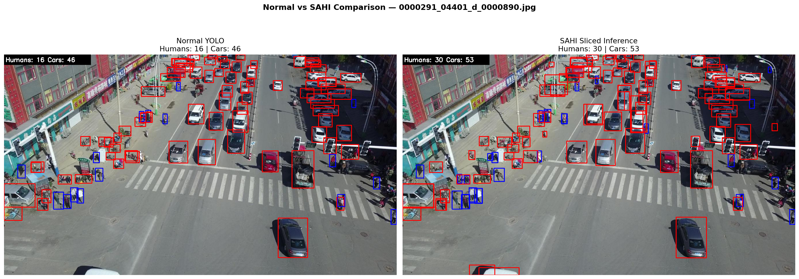
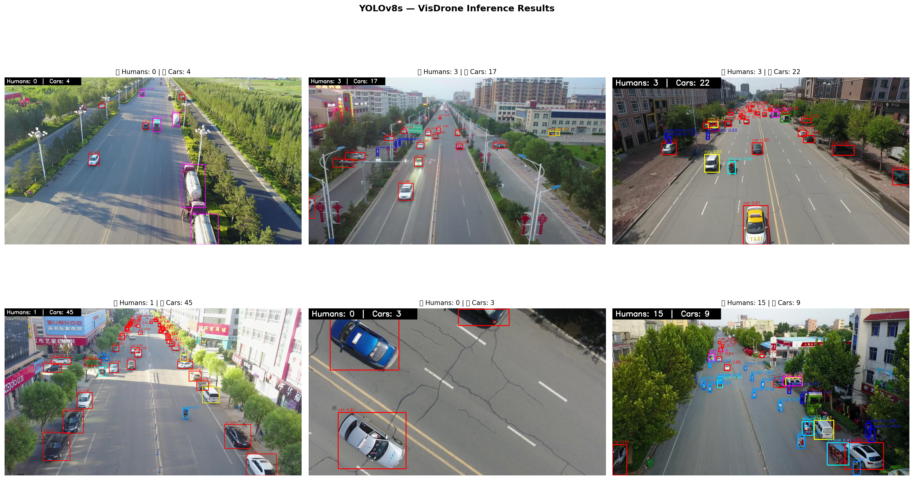
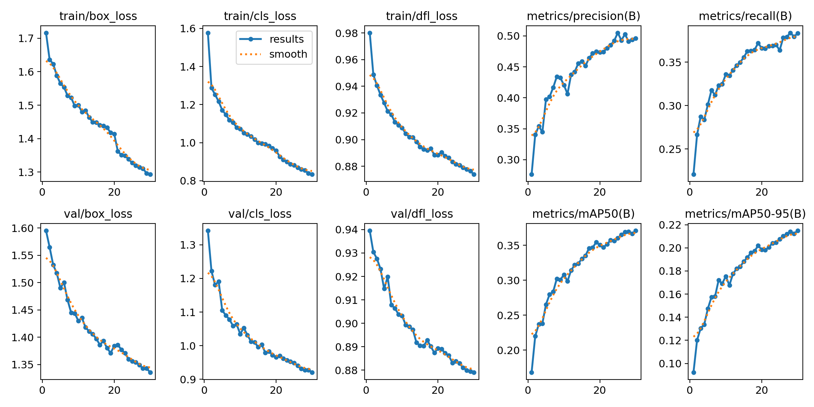

# Drone Object Detection

Human and car detection system using YOLOv8 trained on VisDrone dataset.

## Kaggle Notebooks
- [Training Notebook](https://www.kaggle.com/code/mdtanzimqaiyum/01-visdrone-training)
- [Inference & Evaluation Notebook](https://www.kaggle.com/code/mdtanzimqaiyum/02-visdrone-inference)

## Dataset
- VisDrone2019-DET (YOLO format)
- 6,471 training images, 548 validation images
- 10 classes: pedestrian, people, bicycle, car, van, truck, tricycle, awning-tricycle, bus, motor

## Model
- YOLOv8s fine-tuned on VisDrone
- Optimizer: AdamW | Epochs: 30 | Image size: 640x640
- Built-in augmentations: mosaic, HSV shifts, flipping, scaling, random erasing

## Results

### Validation Set
| Metric | Value |
|--------|-------|
| mAP50 | 0.371 |
| mAP50-95 | 0.215 |
| Precision | 0.496 |
| Recall | 0.383 |

### Test Set
| Metric | Value |
|--------|-------|
| mAP50 | 0.309 |
| mAP50-95 | 0.176 |
| Precision | 0.432 |
| Recall | 0.344 |

### Per Class Results (Validation)
| Class | mAP50 |
|-------|-------|
| Car | 0.775 |
| Bus | 0.532 |
| Van | 0.429 |
| Motor | 0.416 |
| Pedestrian | 0.402 |
| Truck | 0.355 |
| People | 0.292 |
| Bicycle | 0.118 |

## SAHI Sliced Inference
Implemented SAHI to improve tiny human detection by slicing 
images into overlapping 320x320 tiles before inference.

| Method | Humans Detected (20 images) |
|--------|----------------------------|
| Normal YOLOv8 | 351 |
| SAHI Sliced | 642 |
| Improvement | +82.9% |



## Inference Results
- Average humans detected per image: 22.3 (normal)
- Average humans detected per image: 32.1 (SAHI)
- Average cars detected per image: 9.0
- Inference speed: ~2.6ms per image



## Training Results


## Key Observations
- Humans appear extremely small (10-30px) due to aerial viewpoint
- Heavy occlusion in crowded scenes
- Cars easier to detect than humans due to larger size
- YOLOv8 built-in augmentations handle preprocessing automatically
- SAHI sliced inference significantly improves tiny object detection

## Strengths
- Strong car detection (mAP50 0.775)
- Fast inference (~2.6ms per image)
- SAHI improves human detection by 82.9%

## Limitations
- Small objects (bicycle, tricycle) harder to detect
- Heavy occlusion reduces recall
- SAHI increases false positives alongside true positives

## Project Structure
```
drone-object-detection/
├── notebooks/
│   ├── 01-visdrone-training.ipynb
│   └── 02-visdrone-inference.ipynb
├── results/
│   ├── training/
│   │   ├── results.png
│   │   ├── confusion_matrix.png
│   │   └── val_batch0_pred.jpg
│   └── inference/
│       ├── inference_results.png
│       ├── final_results.png
│       └── sahi_comparison.png
├── visdrone_custom.yaml
├── requirements.txt
└── README.md
```
